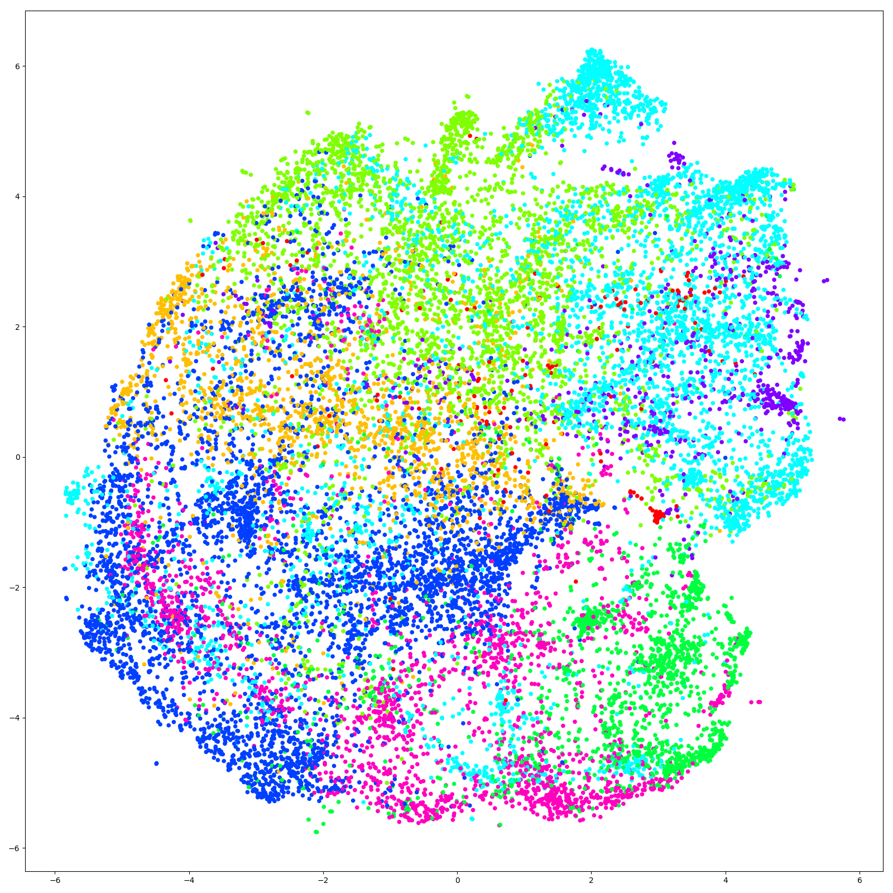

 

# Audio analyzer for [Speech explorer](https://github.com/SSGL-SEP/speech_explorer)

Typically reads data from .wav files and outputs json data used by [Speech explorer](https://github.com/SSGL-SEP/speech_explorer)

Feature extraction from wav files can currently be done with [mfcc](https://en.wikipedia.org/wiki/Mel-frequency_cepstrum), [fft](https://en.wikipedia.org/wiki/Fast_Fourier_transform), [mel-spectrogram](https://en.wikipedia.org/wiki/Mel_scale) or [chroma-stft](https://labrosa.ee.columbia.edu/matlab/chroma-ansyn/).

Dimensionality redcution can be performed in 3d or 2d with either [t-SNE](https://en.wikipedia.org/wiki/T-distributed_stochastic_neighbor_embedding) or [PCA](https://en.wikipedia.org/wiki/Principal_component_analysis).

Additionally `audio_concatenator.py` can be used to create mp3 blobs from wav datasets for use online.

### [Environment](docs/environment.md)

### [crunch.py usage](docs/crunch_usage.md)

### [audio_concatenator.py usage](docs/audio_concatenator_usage.md)

